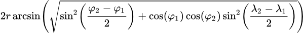

# Desafio Desenvolvedor Full Stack

## Definição do Problema
Sou dono de uma empresa de máquinas de cartão de crédito, e contratei 5 representantes para me ajudar a oferecer meu produto em lojas da grande Florianópolis.
Tenho em mãos uma lista de lojas  que devem ser visitadas. Os representantes trabalham a pé e cobrem um raio de no **_máximo_** 2 km de suas residências.

Gostaria de ter um programa que me ajudasse a **definir quais lojas cada representante deve visitar e mostrasse esse resultado.**

## Observações
  - Arquivos necessários estão na pasta _selecaoinvolves/desafio-localizacao/data_. o Arquivo referente aos representantes contém a lista de representantes contratados.
  Já o arquivo referente as lojas, possui uma lista de possíveis lojas a visitar. Ambos os arquivos contém nome e localização.
  
## Como eu calculo a distância entre duas coordenadas?
  Considerando que temos duas coordenadas diferentes, e queremos saber qual a distância delas em quilômetros, podemos utilizar a fórmula de [_haversine_](https://en.wikipedia.org/wiki/Haversine_formula), a mesma é representada da seguinte forma:
  
  
  
  Meio confuso né? Não tem problema, vamos simplificar a fórmula utilizando um exemplo e pseudo-código.

  ```
  Coordenada número 1: -27.6019111(latitude), -48.5957299(longitude)
  Coordenada número 2: -27.6066129(latitude), -48.5803426(longitude)
  
  Simplificando a fórmula em um pseudo-código temos:
  
  funcao haversine(latitude1, longitude1, latitude2, longitude2) {
    variavel RAIO_TOTAL_DA_TERRA = 6371; // 6371KM
    variavel PI_EM_RADIANOS = 0.017453292519943295; // (3,14 / 180)
    
    variavel somatorioInterno = (0.5 - COSSENO((latitude2 - latitude1) * PI_EM_RADIANOS)/2) 
      + COSSENO(latitude1 * PI_EM_RADIANOS) * COSSENO(latitude2 * PI_EM_RADIANOS) 
      * ((1 - COSSENO(longitude2 - longitude1) * PI_EM_RADIANOS) / 2);
    
    retorna (RAIO_TOTAL_DA_TERRA * 2) * ARCO_SENO(RAIZ_QUADRADA(somatorioInterno));
  }
  
  Chamando a funcão, desta forma: 
  variavel resultado = haversine(-27.6019111, -48.5957299, -27.6066129, -48.5803426);
  
  O resultado deve ser: 1.603832548369759 KM
  ```
  
  **OBSERVAÇÃO:** Não detalhamos os cálculos das funções trigonométricas (seno, cosseno, arco do seno) pois acreditamos que as mesmas estejam implementadas nas linguagens de programação mais conhecidas.
  
  [mais informações caso necessário](https://stackoverflow.com/questions/27928/calculate-distance-between-two-latitude-longitude-points-haversine-formula)

## Requisitos
 - Deverá ser _comitado_ no _github_.
 - Deverá haver uma documentação de como instalar e rodar. Pedimos que o processo de execução do teste seja o mais simples possível (gostariamos de rodar via terminal etc).
 - Nossa stack atualmente consiste de Java e JavaScript, porém o teste pode ser feito em qualquer linguagem de programação.
 - Apresentar os resultados  em um _frontend_
 - Explicação das decisões e arquitetura no _README_. Tenha em mente a importancia desse documento.Procure ser claro e coloque todas as informações que achar relevante.

## Diferenciais.
  - Testes unitários, gostamos.
  - Facilite nossa vida, logs explicando seu algoritmo no console são bem vindos.
  - A forma como você vai exibir os resultados no _frontend_ é livre, seja criativo.
  - Usamos docker #fikdik
  - Gostou do problema? Sobrou tempo? Vá além e implemente novas features que você ache interessante!


